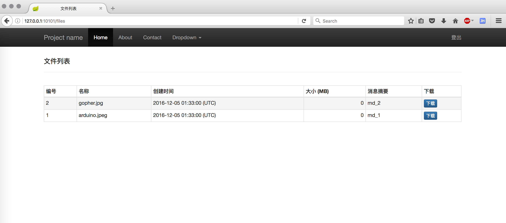
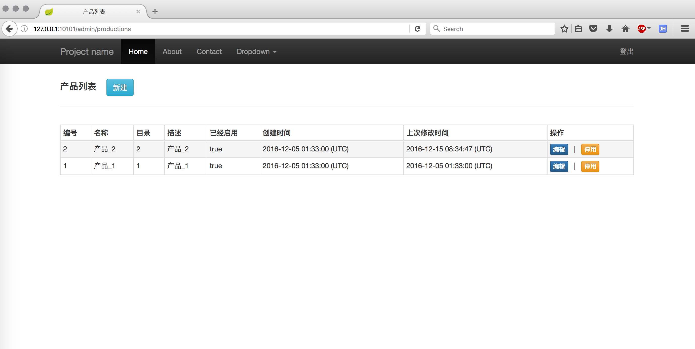
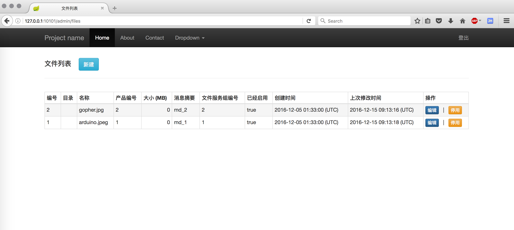

# Nginx-based Large File Downloading Service
This is a large file downloading service based on Nginx, Spring Boot, SQLite(or MySQL). Dynamically adding more files and more Nginx nodes are supportive, which simply requires some registration steps on the administraion Web pages.

## Getting Started
If this program runs in the default mode (SQLite is used), then two account already exist. One is ***admin***, whose password is ***changeme***. The other is ***alice***, whose password is ***test***.

### if you have Docker 
### {
```
# install the image named 'localhost/nfd' into your local docker repo,
# or you can type in shell docker build -t localhost/nfd . 
sh docker_daily_build.sh

# run the program with default ports assignment
docker run -d -p 10101:10101 -p 10102:10102 localhost/nfd

# open your browser, and enter http://127.0.0.1:10101/
# DONE!
# Have Fun!
```
### } 

### else 
### {
#### Requirements
- Java 8
- Maven 3.x

#### Build
```
sh daily_build.sh
```

#### Run
```
cd build
sh startup.sh

# open your browser, and enter http://127.0.0.1:10101/
# DONE!
# Have Fun!
```
### }

## Screenshots of the Ordinary Users
### Main

### File List

### Download Task List


## Screenshots of the Administrators
### Main

### Account List

### Production List

### File List

### Download Task List

### File Service Group List

### File Service List


## Technology Selections
- Web Server: [Nginx](http://nginx.org/) v1.8.0
- App Server: Embedded Tomcat v8.0.26
- Web Framework: [Spring Boot](https://github.com/spring-projects/spring-boot/)  v1.2.6
- ORM for RDBMS: [MyBatis-Spring](http://mybatis.github.io/spring/) v1.1.1
- RDBMS: SQLite(default) or MySQL

## Code Quality


