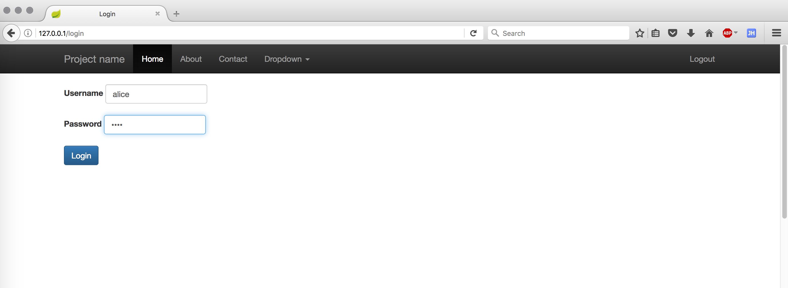
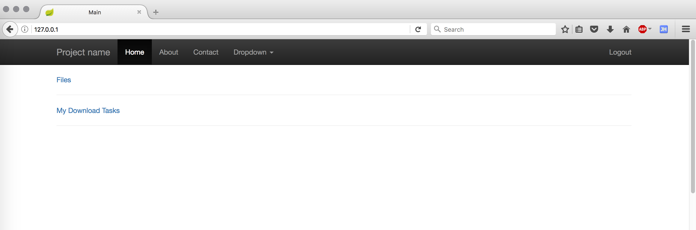
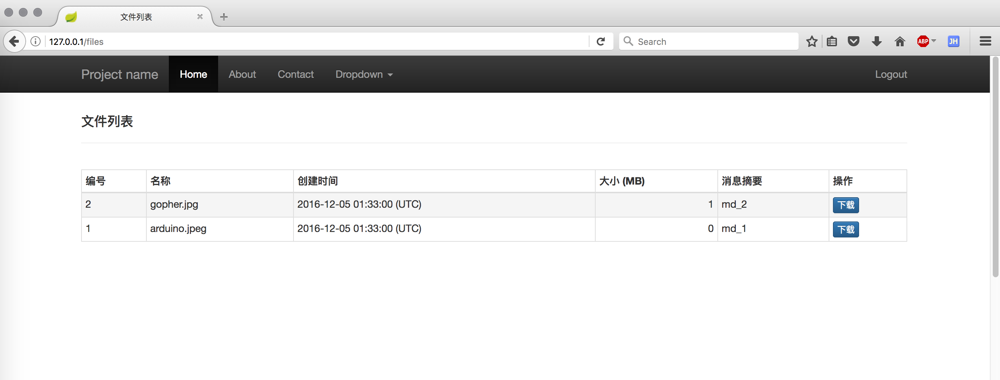
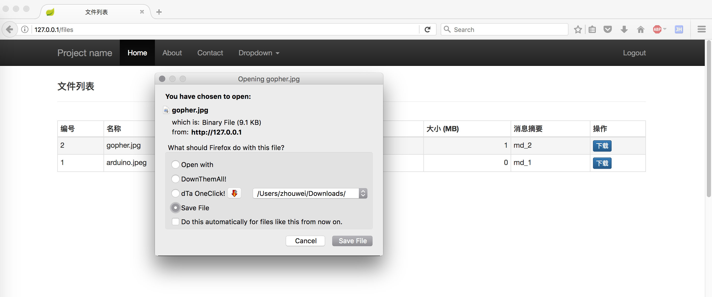
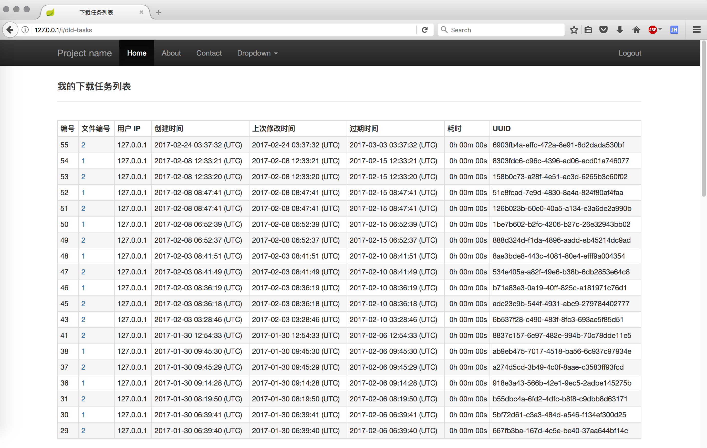
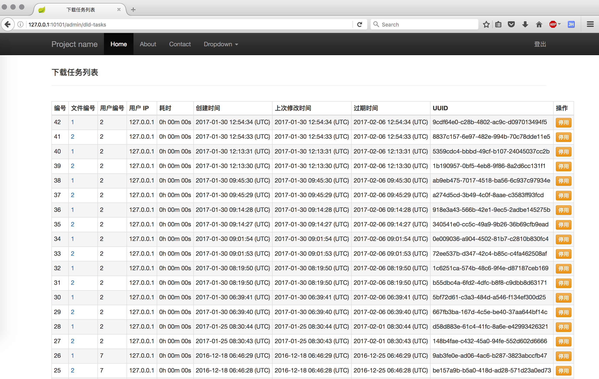
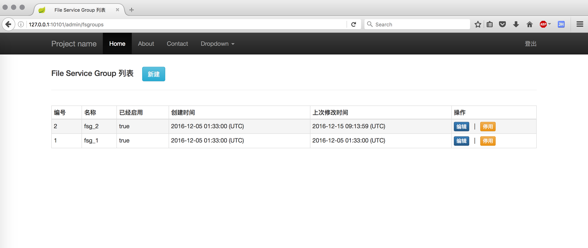
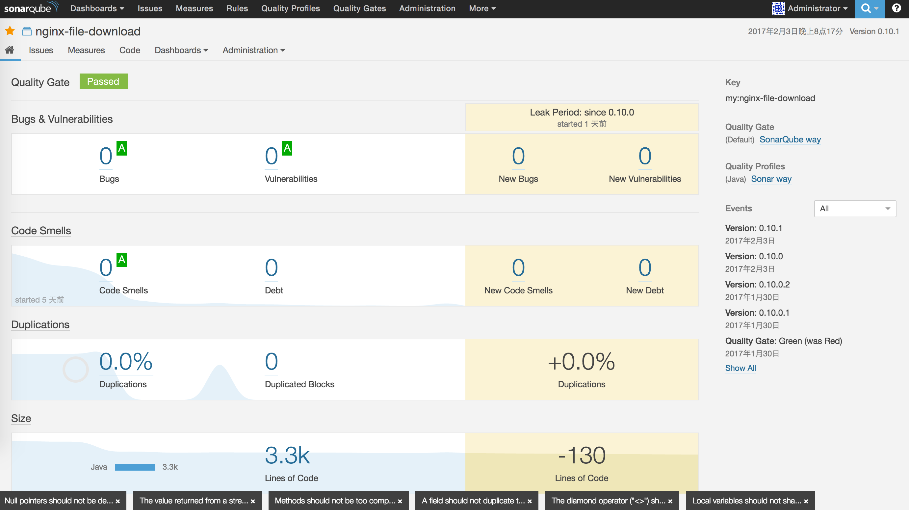

# Nginx-based Large File Downloading Service &nbsp;| &nbsp;[简体中文](README_zh_CN.md)
This is a large file (typically GB in size) downloading service based on Nginx, Spring Boot and SQLite(or MySQL). Dynamically adding more files and more Nginx nodes are supportive, which simply requires some registration steps on the administraion Web pages. What's more, the fundamental support from Nginx is [X-Accel](https://www.nginx.com/resources/wiki/start/topics/examples/x-accel/).

## 1. Technology Stack
- Web Server: [Nginx](http://nginx.org/) v1.8.0
- App Server: Embedded Tomcat v8.0.26
- Web Framework: [Spring Boot](https://github.com/spring-projects/spring-boot/)  v1.2.6
- ORM for RDBMS: [MyBatis-Spring](http://mybatis.github.io/spring/) v1.1.1
- RDBMS: SQLite(default) or MySQL

## 2. Getting Started
If this program runs in the default mode (SQLite and application.properties are used), then two accounts already exist. One is ***admin***, whose password is ***changeme***. The other is ***alice***, whose password is ***test***.

### 2.1. Enter the directory in which this project is located

### 2.2. Prepare downloadable files under /usr/local/var/www/protected
```
sudo mkdir -p /usr/local/var/www
sudo cp -r ./app/external/var/www/protected /usr/local/var/www/
```

### 2.3. Configure your Nginx
The complete nginx.conf can be found [here](https://github.com/leonzhouwei/nginx-file-download/blob/master/app/external/conf/nginx/nginx.conf).

```
# 1. enable sendfile
sendfile        on;

# 2. configure for this project
       location /protected/ {
    		charset utf-8;
    		root /usr/local/var/www;
    		internal;
    	}
    	
    	location / {
    	    proxy_pass  http://127.0.0.1:10101/;  
                proxy_redirect     off;  
                proxy_set_header   Host             $host;  
                proxy_set_header   X-Real-IP        $remote_addr;  
                proxy_set_header   X-Forwarded-For  $proxy_add_x_forwarded_for;  
      
                client_max_body_size       10m;  
                client_body_buffer_size    128k;  
      
                proxy_connect_timeout      90;  
                proxy_send_timeout         90;  
                proxy_read_timeout         90;  
      
                proxy_buffer_size          4k;  
                proxy_buffers              4 32k;  
                proxy_busy_buffers_size    64k;  
                proxy_temp_file_write_size 64k;
    	}
```


### 2.4. Run this project
#### if you have Docker 
#### {
```
# install the Docker image named 'localhost/nfd' into your local Docker repo,
# or you can type in shell: docker build -t localhost/nfd 
sh docker_daily_build.sh

# run the program with default ports assignment
docker run -d -p 10101:10101 -p 10102:10102 localhost/nfd
```
#### } 

#### else 
#### {
Requirements

- Java 8
- Maven 3.x

Build

```
sh daily_build.sh
```

Run

```
cd build
sh startup.sh
```
### }

### 2.5. Open your browser, and goto http://127.0.0.1/

### 2.6. Login (alice:test)


### 2.7. Main page


### 2.8. File list


### 2.9. Download gopher.jpg


### 2.10. Download task list
Go back to main page, and click "My Download Task List".


## 3. Screenshots of the Administrator
### 3.1. Main

### 3.2. Account List

### 3.3. Production List

### 3.4. File List

### 3.5. Download Task List

### 3.6. File Service Group List

### 3.7. File Service List


## 4. Code Quality



