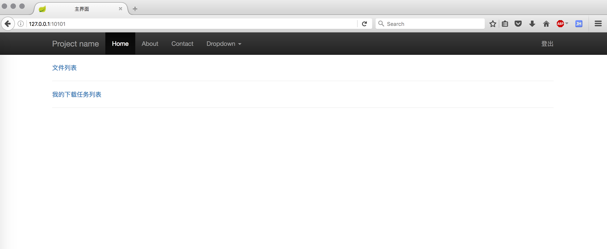
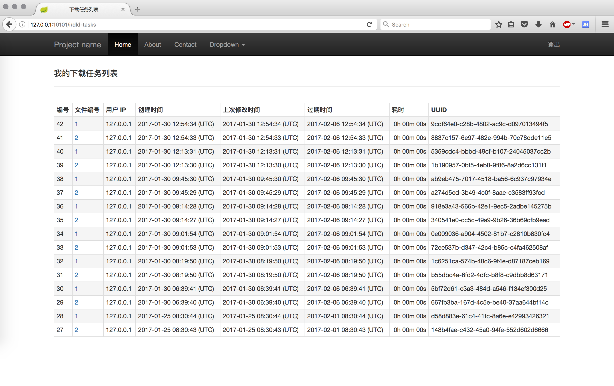
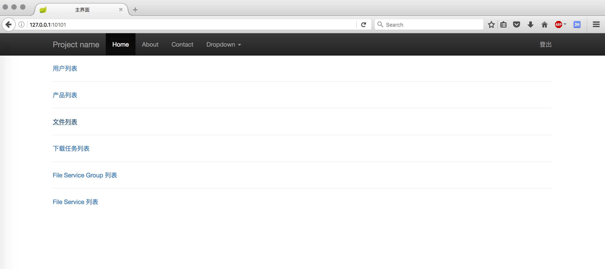
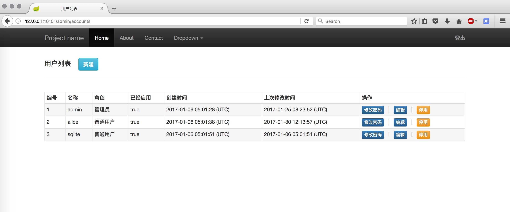
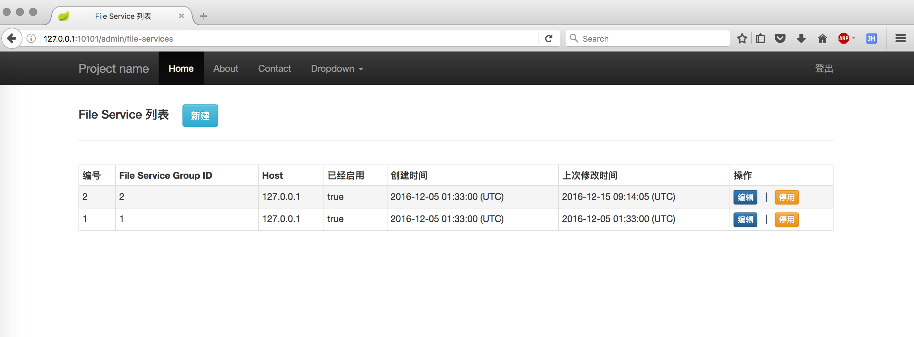

# Nginx-based Large File Downloading Service
This is a large file downloading service based on Nginx, Spring Boot, SQLite(or MySQL). Dynamically adding more files and more Nginx nodes are supportive, which simply requires some registration steps on the administraion Web pages.

## Technology Selections
- Web Server: [Nginx](http://nginx.org/) v1.8.0
- App Server: Embedded Tomcat v8.0.26
- Web Framework: [Spring Boot](https://github.com/spring-projects/spring-boot/)  v1.2.6
- ORM for RDBMS: [MyBatis-Spring](http://mybatis.github.io/spring/) v1.1.1
- RDBMS: SQLite(default) or MySQL

## Some Screenshots of the Ordinary Users
### Main

### File list

### Download task list

## Some Screenshots of the Administrators
### Main

### Account list

### Production list

### File list

### Download task list

### File service group list

### File service list

