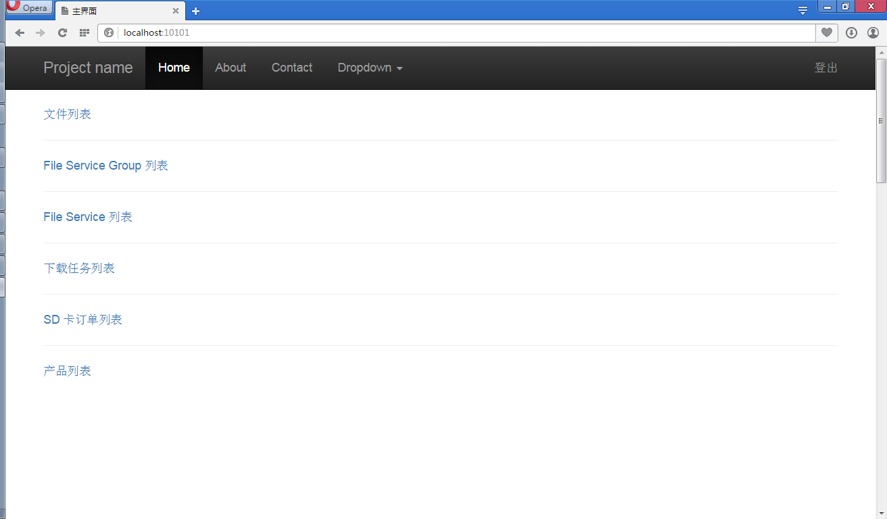
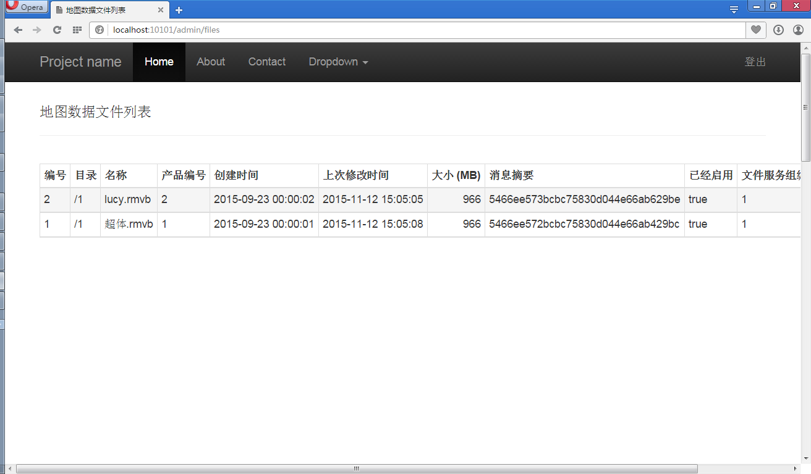
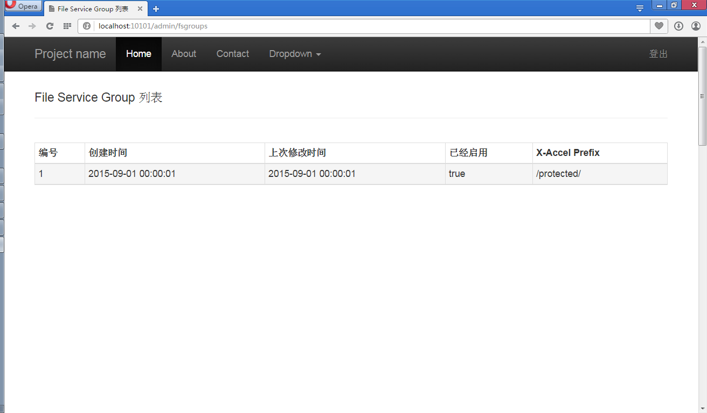
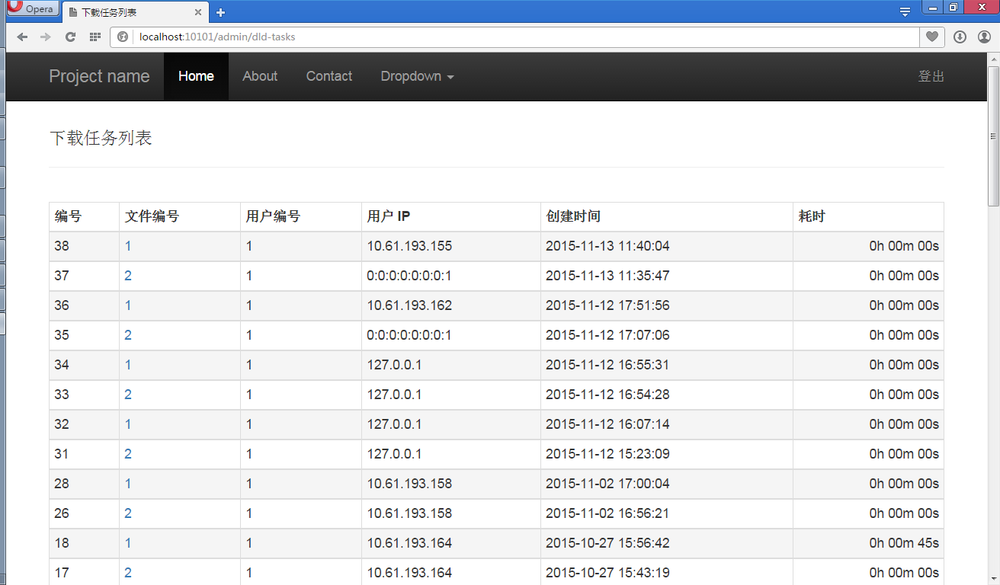

# Nginx-based Large Files Downloading Service
This is a large files downloading service based on Nginx, Spring Boot, PostgreSQL and SSDB. Dynamically adding more files and more Nginx nodes are supportive, which simply requireds some registration steps on the administraion Web pages.

## Technology Selections
- Web Server: [Nginx](http://nginx.org/) v1.8.0
- App Server: Embedded Tomcat v8.0.26
- Web Framework: [Spring Boot](https://github.com/spring-projects/spring-boot/)  v1.2.6
- ORM for RDBMS: [MyBatis-Spring](http://mybatis.github.io/spring/) v1.1.1
- Download History Data Storage: [SSDB](https://www.github.com/ideawu/ssdb/)  v1.8.2
	- About 30 download history records per GB
- Other Data Storage (users, large Files for downloading, download tasks, etc.): [PostgreSQL](http://www.postgresql.org/)  v9.2

## Some Screenshots of the Admistrations
### main

### file list

### file service group list

### file service list

### download task list

